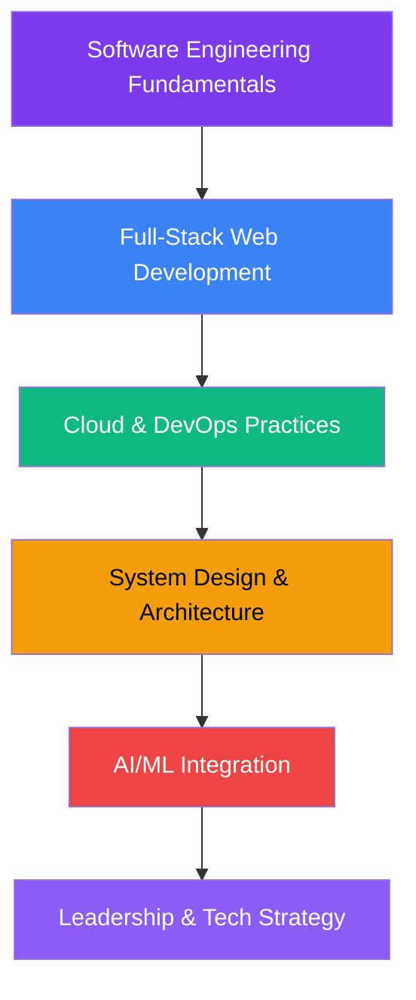

<!-- ====================== HERO SECTION ====================== -->
<div align="center">
  
  
  
  # 🚀 Hiruni Hapuarachchi
  
  ### **Software Engineering Student | MERN Stack Developer | Cloud & AI Enthusiast**
  
  <div align="center">
    
  </div>
  
  <br/>
  
  
  
</div>

---

## 👩‍💻 **About Me**

> *"Transforming complex problems into elegant software solutions"*

🎓 **BSc (Hons) Software Engineering** @ **National Institute of Business Management (NIBM)**  
💼 **Software Engineer Intern** @ **SLT-Mobitel** • *Building enterprise-grade solutions*  
🌟 **MERN Stack Specialist** with **2+ years** of hands-on development experience  
🔭 **Research Interests:** Cloud Computing, AI/ML Integration, Scalable System Architecture  

I'm a passionate software engineer focused on building **production-ready applications** with clean architecture, optimal performance, and exceptional user experiences. My approach combines **theoretical knowledge** from academia with **practical implementation** from industry experience.

**Core Philosophy:**  
```javascript
while(alive) {
  learn();
  build();
  improve();
  contribute();
}
```

---

## 📞 **Connect With Me**

<div align="center">
  
  [](https://linkedin.com/in/hirunihapuarachchi)
  [](https://github.com/hirunih)
  [](https://hiruni.dev)
  [](https://leetcode.com/u/hirunih/)
  [](https://medium.com/@hirunih)
  [](mailto:hiruni@example.com)

</div>

---

## 🛠️ **Technical Arsenal**

### **📊 GitHub Analytics**

<div align="center">
  
  
  
  
  
</div>

### **🔷 Programming Languages**


### **🌐 Frontend Ecosystem**


### **⚙️ Backend & APIs**


### **🗄️ Databases & Storage**


### **☁️ Cloud & DevOps**


### **🤖 AI/ML & Data Science**


### **🛠️ Developer Tools**


---

## 📈 **Current Focus & Development**

<div align="center">

| **Area** | **Technologies** | **Projects** |
|----------|------------------|--------------|
| **🔷 Full-Stack Development** | MERN Stack, Next.js 14, TypeScript | E-commerce platforms, SaaS products |
| **☁️ Cloud Architecture** | AWS (EC2, S3, Lambda), Docker, Kubernetes | Microservices, Serverless applications |
| **🤖 AI Integration** | Python, TensorFlow, OpenAI API | Intelligent chatbots, ML-powered features |
| **📱 Mobile Development** | React Native, Flutter | Cross-platform mobile applications |
| **🔒 Security & Performance** | JWT, OAuth, Redis, CDN | Secure auth systems, optimized APIs |

</div>

---

## 🏆 **Featured Projects**

### **🚀 [Project Elysium](https://github.com/hirunih/elysium)**  
*Enterprise Resource Planning System*  
`React` `Node.js` `MongoDB` `AWS` `Docker`  
> A comprehensive ERP solution with real-time analytics, inventory management, and AI-powered forecasting.

### **🎯 [Nexus API Gateway](https://github.com/hirunih/nexus-gateway)**  
*Microservices API Gateway*  
`Node.js` `Redis` `JWT` `Rate Limiting` `Load Balancing`  
> High-performance API gateway with authentication, rate limiting, and request routing for microservices.

### **🧠 [CogniLearn AI](https://github.com/hirunih/cognilearn)**  
*Adaptive Learning Platform*  
`Python` `TensorFlow` `React` `Flask` `PostgreSQL`  
> AI-powered educational platform that adapts content based on learner's progress and understanding patterns.

### **📊 [DataViz Analytics](https://github.com/hirunih/dataviz)**  
*Real-time Data Visualization*  
`Next.js` `D3.js` `WebSockets` `Firebase` `Chart.js`  
> Interactive dashboard for real-time data visualization with customizable widgets and reports.

---

## 📚 **Learning Journey**



**Currently Deep Diving Into:**
- 🏗️ **System Design Patterns** (Microservices, Event-Driven Architecture)
- 🔐 **Advanced Security** (OAuth 2.0, JWT, API Security)
- 📱 **Mobile Development** (React Native, Progressive Web Apps)
- 🤖 **Generative AI** (LLMs, LangChain, Vector Databases)

---

## 🎯 **Professional Philosophy**

```yaml
development_principles:
  - clean_code: "Write code that humans can understand"
  - scalability: "Design for growth from day one"
  - performance: "Optimize for real-world usage"
  - security: "Security is not an afterthought"
  - documentation: "Good docs enable great collaboration"
  - testing: "Test early, test often, test automatically"

learning_approach:
  - depth_over_breadth: "Master fundamentals deeply"
  - build_to_learn: "Practical implementation over theory"
  - teach_to_consolidate: "Share knowledge to strengthen understanding"
  - stay_curious: "Always ask 'why' and 'how can this be better'"
```

---

<div align="center">

## 📊 **GitHub Contribution Graph**


---

## ✨ **Featured Quote**

> *"The most powerful tool we have as developers is not a framework or a language, but our ability to decompose complex problems into simple, elegant solutions."*

---

### **🚀 Let's Build the Future Together!**


**Code with purpose • Build with passion • Scale with precision**

</div>
10. **Visual Appeal**: Better color scheme and layout

The new design is more professional, detailed, and showcases your skills in a more comprehensive way while maintaining readability and visual appeal.
