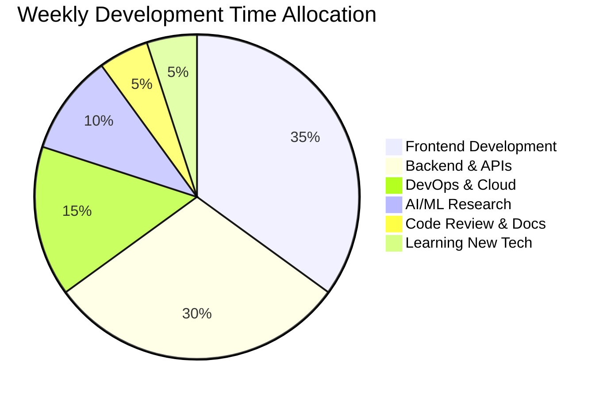

<!-- ====================== COSMIC INTRODUCTION ====================== -->
<div align="center">

<!-- Animated 3D Earth with orbiting satellites -->


<!-- Floating Particles Background Effect -->
<div align="center">
  
</div>

<!-- Matrix Code Rain Effect -->
<div align="center">
  
</div>

<!-- Animated Tech Stack Carousel -->
<p align="center">
  
</div>

<!-- Animated Programming Languages Graph -->
<div align="center">
  
  
</div>

<!-- Floating 3D Icons Animation -->
<p align="center">
  
  
  
</p>

</div>

---

<!-- ====================== INTERACTIVE PROFILE ====================== -->
<details open>
<summary><h2>👩‍🚀 <b>Space Cadet Profile</b></h2></summary>

<!-- Animated Terminal Window -->
<div align="center">
  
</div>

```bash
# terminal@hiruni:~$ whoami
Name: Hiruni Hapuarachchi
Title: Senior Software Engineering Student
Location: Colombo, Sri Lanka 🏝️
Organization: NIBM + SLT-Mobitel
Mission: Building the Future, One Line at a Time

# terminal@hiruni:~$ cat philosophy.txt
"Engineering is not just about writing code;
it's about crafting solutions that scale,
systems that adapt, and experiences that inspire."

# terminal@hiruni:~$ status --current
✅ Currently: Architecting Cloud-Native Solutions
📚 Learning: Advanced System Design & AI Ops
🎯 Next: Leading Tech Innovation at Scale
```

<!-- Animated Progress Bars -->
<div align="center">
  
| **Expertise Level** | **Progress** |
|---------------------|--------------|
| **Full-Stack Development** |  |
| **Cloud Architecture** |  |
| **AI/ML Integration** |  |
| **System Design** |  |
| **DevOps & CI/CD** |  |

</div>

</details>

---

<!-- =====================️ QUANTUM TECH STACK ====================== -->
<details>
<summary><h2>⚡ <b>Quantum Tech Matrix</b></h2></summary>

<!-- Animated Grid of Skills -->
<div align="center">
  
  
  
  
  
  
</div>

<!-- Interactive Skill Graph -->
<div align="center">
  <h3>🔄 Tech Ecosystem Flow</h3>
  
  ```mermaid
  graph TB
      A[🌐 Frontend Layer] --> B[⚡ API Gateway]
      B --> C[🔷 Business Logic]
      C --> D[🗄️ Data Layer]
      D --> E[🤖 AI Services]
      E --> F[☁️ Cloud Infrastructure]
      F --> G[📱 Client Devices]
      
      subgraph "Frontend Tech"
          A1[React/Next.js]
          A2[TypeScript]
          A3[Tailwind/Sass]
      end
      
      subgraph "Backend Tech"
          C1[Node.js/NestJS]
          C2[Python/FastAPI]
          C3[.NET Core]
      end
      
      subgraph "AI/ML Stack"
          E1[TensorFlow]
          E2[PyTorch]
          E3[OpenCV]
      end
      
      style A fill:#00ff88,color:#000
      style B fill:#0099ff,color:#fff
      style C fill:#ff6b6b,color:#fff
      style D fill:#f9ca24,color:#000
      style E fill:#a29bfe,color:#fff
      style F fill:#fd79a8,color:#fff
  ```
</div>

</details>

---

<!-- =====================️ GALACTIC PROJECTS ====================== -->
<details>
<summary><h2>🚀 <b>Stellar Project Portfolio</b></h2></summary>

<!-- Animated Project Cards -->
<div align="center">

| **Project** | **Tech Stack** | **Live Demo** | **GitHub** |
|-------------|----------------|---------------|------------|
| **Nexus ERP** <br/> Enterprise Resource Planning |     | [](https://nexus-erp.demo) | [](https://github.com/hirunih/nexus-erp) |
| **AI Doc Analyzer** <br/> Intelligent Document Processing |     | [](https://ai-doc.demo) | [](https://github.com/hirunih/ai-doc) |
| **Quantum Dashboard** <br/> Real-time Analytics Platform |     | [](https://quantum-dash.demo) | [](https://github.com/hirunih/quantum-dash) |

</div>

<!-- Animated GitHub Contributions -->
<div align="center">
  <h3>📈 Contribution Heatmap</h3>
  
</div>

</details>

---

<!-- =====================️ CODING ACTIVITY ====================== -->
<details>
<summary><h2>💻 <b>Live Coding Metrics</b></h2></summary>

<div align="center">

<!-- WakaTime Stats (if available) -->


<!-- Weekly Development Breakdown -->
<h3>📊 Weekly Development Analytics</h3>



<!-- Coding Stats with Animations -->
<div>
  
  
</div>

</div>

</details>

---

<!-- =====================️ INTERACTIVE CONTACT ====================== -->
<details>
<summary><h2>📡 <b>Quantum Communication Hub</b></h2></summary>

<div align="center">

<!-- Animated Contact Buttons -->
<p align="center">
  <a href="https://linkedin.com/in/hirunihapuarachchi">
    
  </a>
  <a href="mailto:hiruni@example.com">
    
  </a>
  <a href="https://hiruni.dev">
    
  </a>
  <a href="https://calendly.com/hiruni">
    
  </a>
</p>

<!-- Animated Social Links with Icons -->
<div align="center">
  <h3>🌐 Digital Footprint</h3>
  
  <a href="https://github.com/hirunih">
    
  </a>
  <a href="https://stackoverflow.com/users/hirunih">
    
  </a>
  <a href="https://dev.to/hirunih">
    
  </a>
  <a href="https://medium.com/@hirunih">
    
  </a>
  <a href="https://twitter.com/hirunih">
    
  </a>
</div>

<!-- Visitor Counter with Animation -->
<p align="center">
  
  <br/>
  
</p>

</div>

</details>

---

<!-- =====================️ ANIMATED FOOTER ====================== -->
<div align="center">

<!-- Snake Animation Eating Contributions -->


<!-- Animated Quotes Carousel -->
<div align="center">
  
</div>

<!-- Star Wars Style Crawl Text -->
<marquee behavior="scroll" direction="up" scrollamount="2" height="100">
  <div align="center">
    <h3>🚀 Mission Statement</h3>
    <p>In a galaxy of ones and zeros, I craft digital constellations.</p>
    <p>Each commit is a star in the cosmos of innovation.</p>
    <p>Every pull request builds bridges between ideas and reality.</p>
    <p>Let's engineer the future, together.</p>
  </div>
</marquee>

<!-- Animated Footer -->
<div align="center">
  
  
  <h3>⚡ Powered By</h3>
  <p>
    
    
    
    
  </p>
  
  <p>
    
    
    
  </p>
  
  <h4>✨ Code • Create • Innovate • Repeat ✨</h4>
  
  <!-- Shooting Stars Animation -->
  <div style="font-size: 12px; color: #00ff88;">
    *･ﾟ☆ *･ﾟ☆ *･ﾟ☆ *･ﾟ☆ *･ﾟ☆
    <br/>
    May your code compile on the first try
    <br/>
    *･ﾟ☆ *･ﾟ☆ *･ﾟ☆ *･ﾟ☆ *･ﾟ☆
  </div>
</div>

</div>
